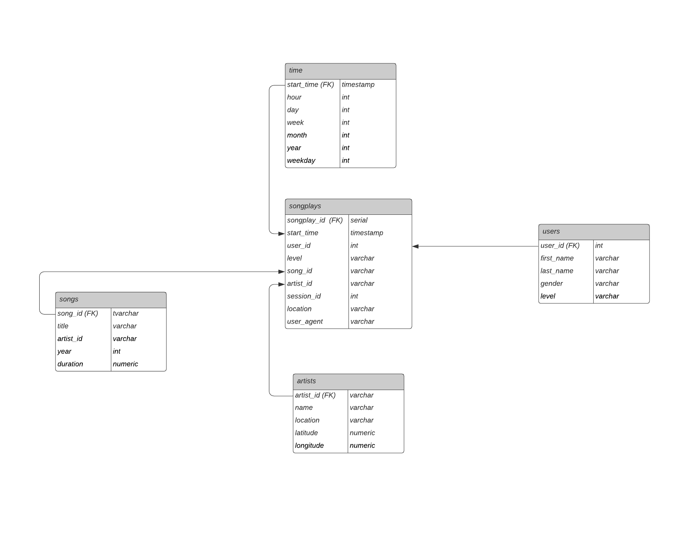

# Sparkify Data Warehouse

> The project helps a music streaming startup Sparkify to move their user and song database into a data warehouse on AWS. 
An ETL pipleline is built to extract data from S3, stage them in AWS Redshift, and tranform them into dimensional tables for analytic queries.

## Table of contents
* [Setup](#setup)
* [Data Warehouse](#data-warehouse)
* [ETL Pipeline](#etl-pipeline)
* [Instructions](#instructions)
* [Example Queries and Results](#example-queries-and-results)

## Setup
* sql_queries.py contains all the sql queries and is imported into two files below.
* create_tables.py drops and creates your tables. You run this file to reset your tables before each time you run your etl.py.
* etl.py to reads and processes files from song_data and log_data and loads them into your tables.
* dwh.cfg contains configuration to connect to S3 and Redshif cluster.

## Data Warehouse
The data warehouse contains two staging tables and a database based on a star schema.

### Staging Tables

**staging_events**: user activity on the app, extracted from JSON logs in S3 bucket 's3://udacity-dend/log_data'
(columns: event_id, artist, auth, firstName, gender, itemInSession, lastName, 
length, level, location, method, page, registration, sessionId, song, status, ts, userAgent, userId)

And below is an example of what the data in a log file, 2018-11-12-events.json, looks like.


**staging_songs**: song information, extracted from JSON metadata in S3 bucket 's3://udacity-dend/song_data'
(columns: num_songs, artist_id, artist_latitude, artist_longitude, artist_location, artist_name, song_id, title, duration, year)

Below is an example of what a single song file, TRAABJL12903CDCF1A.json, looks like.
```
{"num_songs": 1, "artist_id": "ARJIE2Y1187B994AB7", "artist_latitude": null, 
"artist_longitude": null, "artist_location": "", "artist_name": "Line Renaud", "song_id": "SOUPIRU12A6D4FA1E1", 
"title": "Der Kleine Dompfaff", "duration": 152.92036, "year": 0}
```

### Database Schema 

The database is created on a star schema including five tables. 

The fact table is **songplays** - records in log data associated with song plays i.e. records with page NextSong.
**songplays** as the fact table consists of foreign key to four dimension tables: **users**,**songs**,**artists**,**time**.




## ETL Pipeline

ETL Pipeline is built to 
+ extract data from a directory of JSON logs on user activity and JSON metadata on the songs storein S3.
+ stages the data in two staging tables in AWS Redshift.
+ transforms staing tables into analytics tables.

### Data Cleaning

* The staging tables are copied directly from the source data and no filtering or constraints are applied at this stage.
* Filter on column page = 'NextSong' when transforming staging_events.
* Use DISTINCT to handles duplicate records where appropriate.

## Instructions

* First fill in dwh.cfg your own cluster details and credentials.
* Then run create_tables.py to drop and create tables in Redshift.
* Last run etl.py to transfer data into the data warehouse.


## Example Queries and Results
Question: Is there subscription percentage difference between male and female users?

Queries:
```
"SELECT gender, 
        COUNT(*) AS gender_count, 
        ROUND(AVG(CASE WHEN level = 'paid' THEN 100 ELSE 0 END),2) AS paid_percentage
FROM (SELECT DISTINCT s.user_id, 
                      gender, 
                      s.level 
      FROM songplays s 
      JOIN users u 
      ON s.user_id = u.user_id) t
GROUP BY 1"
```

Results:
```
gender gender_count paid_percentage
F        60           25.00%
M        44           15.91%
```

**Subscription rate is higher for female in the sample**